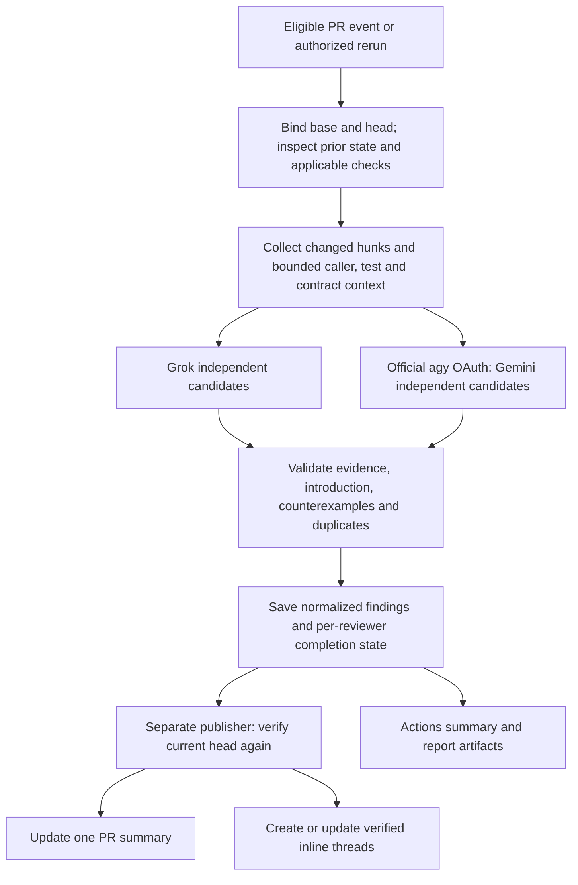

# PR review quality and delivery

Status: researched design, September 14, 2026. English model output and report
labels are deployed. The publication and harness improvements below are proposed;
automatic PR comments remain disabled. The current operational contract is in
[the tool README](../../tools/pr_review/README.md).

## Recommendation

Keep Grok and the official agy CLI with personal OAuth. Improve the coordinator
around them in this order: concise PR feedback, better context and verification,
then incremental review state and targeted specialist policies. Preserve two
independent opinions and the separate publisher. A third general reviewer is not
a prerequisite for these improvements.

Use one updated PR summary comment as the entry point, add verified actionable
findings as line-level review threads when mapping and lifecycle support are
ready, and keep complete normalized reports in Actions artifacts. A successful
provider call, an empty finding list and merge approval are different outcomes.

## Evidence from T3 Code PR 8103

The inspected [cross-platform window-capture PR](https://github.com/pingdotgg/t3code/pull/8103)
contains 261 commits and 207 changed files. Paginated REST reads returned 83 issue
comments, 329 review submissions and 380 inline comments. GraphQL returned 155
threads, all resolved, including 131 outdated threads. Macroscope and CodeRabbit
created 124 and 30 root inline comments respectively; the remaining bot inline
entries include replies. These are interaction counts, not confirmed bug counts,
independent full reviews or accuracy measurements. This large PR is not a cost
baseline for ordinary Cortex changes.

The final PR head is `07c887d86c04dfaee197fe2d645470ab64d304fb`; its final base is
`09e8de9c655ae85410bf6b00446f272a01da81c7`. The four review configuration files below
match at those revisions. Current main was also inspected at
`6dbea7ed0947780694943bd86c4cd22cebbcd8eb` to avoid confusing later policy edits
with the historical review.

### Separate services and policies

The review/check authors identify CodeRabbit and Macroscope as GitHub Apps.
T3 Code's interactive provider adapters and the PR author's coding harness are
separate from those review services. Public YAML and Markdown expose configuration
and observable behavior; they do not expose the complete hosted implementations,
internal model routing or every setting in the vendors' dashboards.

| Component | Observed configuration or behavior | What Cortex can reuse |
| --- | --- | --- |
| CodeRabbit | `.coderabbit.yaml` enables auto review and disables `review_status`; visible comments still provide summaries and actionable findings | An updated summary and incremental review lifecycle; do not interpret `review_status: false` as disabling review comments |
| Macroscope correctness | General bug findings, inline replies, and a separate correctness check | Trace consequences across callers and verify candidates before publishing |
| Effect Service Conventions | `gpt-5-6-sol`, medium effort, full diff, TypeScript paths, tests excluded, trusted label, passing `Check`, budgets of 5 per run / 25 per PR | Small explicit domain policies with applicability and spending limits |
| UI Consistency | `gpt-5-6-terra`, medium effort, full diff, web TSX/CSS paths, trusted label, passing `Check`, budgets of 2 per run / 10 per PR | Target only relevant changes; keep UI conventions distinct from runtime bugs |
| Approvability | Product-default changes and broader diagnostic suppressions require human review | Separate review findings from decisions about accepting product or operational risk |

The specialty policies allow `browse_code` and `modify_pr`; their `failure`
conclusion can fail a check, but does not by itself establish GitHub branch
protection requirements. The budget values use Macroscope's USD configuration,
not subscription token quotas. Sources: [CodeRabbit config](https://github.com/pingdotgg/t3code/blob/09e8de9c655ae85410bf6b00446f272a01da81c7/.coderabbit.yaml),
[Effect policy](https://github.com/pingdotgg/t3code/blob/09e8de9c655ae85410bf6b00446f272a01da81c7/.macroscope/check-run-agents/effect-service-conventions.md),
[UI policy](https://github.com/pingdotgg/t3code/blob/09e8de9c655ae85410bf6b00446f272a01da81c7/.macroscope/check-run-agents/ui-consistency.md),
[approvability policy](https://github.com/pingdotgg/t3code/blob/09e8de9c655ae85410bf6b00446f272a01da81c7/.macroscope/approvability.md).

A separate [Cursor hygiene workflow](https://github.com/pingdotgg/t3code/blob/09e8de9c655ae85410bf6b00446f272a01da81c7/.github/workflows/cursor-hygiene-webhook.yml)
forwards events to a private authenticated webhook. Its receiver and reasoning
loop are not public in that file; copying the forwarding YAML cannot reproduce
that service. The [vouch workflow](https://github.com/pingdotgg/t3code/blob/09e8de9c655ae85410bf6b00446f272a01da81c7/.github/workflows/pr-vouch.yml)
maintains author-trust labels. Cortex's existing same-repository/main boundary is
sufficient for the current operator; a label alone must not grant secrets.

### Context and verification are visible in the review

In a [CodeRabbit IPC finding](https://github.com/pingdotgg/t3code/pull/8103#discussion_r3846889688),
the visible tool trace searches IPC handlers, renderer origins, capture services,
consumers and tests. The author replies with a fix commit. The bot then reads the
updated implementation, distinguishes global-shortcut capture from authenticated
manual capture, withdraws the finding and resolves the thread in a
[verification reply](https://github.com/pingdotgg/t3code/pull/8103#discussion_r3847253472).
This is stronger evidence of a review loop than a single diff summary. Public
execution traces show tool use, not guaranteed access to every internal step.

CodeRabbit's [architecture description](https://www.coderabbit.ai/blog/explainable-reviews-coderabbit-review-context-engine)
explains context retrieval, dependency graphs, policy enrichment, candidate
reviewers, verification and evaluation against precision/recall, latency and
cost. Those are vendor-described mechanisms, not a reproducible source release
or independent proof of accuracy on this PR. The applicable lesson is to supply
relevant caller/test context and verify a finding's causal claim.

### Revisions, feedback and limits matter

The PR shows explicit [incremental review commands](https://github.com/pingdotgg/t3code/pull/8103#issuecomment-5400286576),
[a repeated-head skip](https://github.com/pingdotgg/t3code/pull/8103#issuecomment-5401235888),
[a changed-head refusal](https://github.com/pingdotgg/t3code/pull/8103#issuecomment-5403809691),
and [full-review fallback when incremental comparison is incomplete](https://github.com/pingdotgg/t3code/pull/8103#issuecomment-5468501774).
The summary reports reviewed commit ranges, selected/skipped files and automatic
pause. CodeRabbit's [controls](https://docs.coderabbit.ai/configuration/auto-review)
and [commands](https://docs.coderabbit.ai/guides/commands) describe these modes.

Authors also dispute findings using specific source or test evidence, such as
[this platform-output objection](https://github.com/pingdotgg/t3code/pull/8103#discussion_r3890260402).
A reply asserting a false positive must trigger verification, not become trusted
policy automatically. Persist general review-rule changes only through a trusted
policy change. Do not infer correctness from a resolved/outdated thread.

At the final head, Macroscope's [correctness check](https://github.com/pingdotgg/t3code/runs/101902033709)
was skipped: its displayed estimate was $32.44 against an $8 per-review limit.
The [UI check](https://github.com/pingdotgg/t3code/runs/101902035478) and
[Effect check](https://github.com/pingdotgg/t3code/runs/101902034099) were also
skipped because of a reported per-PR limit. The [approvability check](https://github.com/pingdotgg/t3code/runs/101902035156)
was neutral/not approved with correctness unavailable. These are visible check
states, not billing records. The PR's eventual merge does not establish that
all AI reviewers completed on the final revision.

Macroscope documents explicit applicability, prerequisites, tool selection and
best-effort budget enforcement in its [Check Run Agent contract](https://docs.macroscope.com/check-run-agents).
Its [correctness settings](https://docs.macroscope.com/bug-detection-and-fixes)
separate detection depth from the minimum severity that becomes a comment.
Borrow those distinctions. Avoid reproducing every status acknowledgement,
large generic walkthrough, docstring-percentage warning or style suggestion.

## Gaps in the current Cortex harness

| Layer | Current behavior | Recommended next behavior |
| --- | --- | --- |
| Authentication/execution | Pinned agy, renewed consumer OAuth, isolated HOME, denied resource operations; Grok gateway | Keep these qualified adapters |
| Context | 180,000-character packet; patches and selected full changed files; no callers, graph or targeted tests | Budget changed hunks first, then retrieve relevant immutable caller/test/contract context |
| Candidate quality | Both reviewers receive one packet; evidence must be a substring; line checked against supplied head text | Verify introduction, reachable trigger, consequence and counterevidence before public findings |
| Revisions | Full bounded packet each run; cancellation coalesces PR heads | Skip identical reviewed inputs; track successful baseline per reviewer; support incremental and explicit full review |
| Delivery | Actions summary/artifacts; existing marked-comment upsert is disabled | Concise updated PR summary, then properly mapped line-level threads |
| Lifecycle | Findings carry IDs but no persistent feedback or resolved state | Stable issue identity, explicit fixed/disputed/not-rechecked states and re-verification |
| Budgets | Per-process deadlines, output cap and account serialization | Per-PR run/token budgets, pause status and controlled reruns |
| Measurement | Unit/security checks and live acceptance | A small historical evaluation set with known regressions, clean controls and disputed findings |

Specific implementation implications:

- `prepare` can spend most of its budget on early full files and omit later
  patches. Reserve coverage for changed hunks first and report files/lines
  actually supplied. An omitted file is not a clean review of that file.
- `parse_findings` verifies text/location, not whether the quoted line changed or
  the claimed bug is real. A line in full head text is not automatically a valid
  GitHub diff anchor. Rename/deletion/base-side mapping requires additional data.
- `finding_id` currently includes a model-written title. A wording change can
  produce a different ID for the same problem. Durable identity should use a
  stable rule/category, normalized evidence/context and path lineage.
- `config_id` hashes backend definitions; it is not a complete cache key for
  resolved models, prompt language, native release or retrieval policy. Include
  those versions plus immutable base/head and context hashes before adding reuse.
- Current three-day artifacts are useful run evidence, but are not a durable
  incremental-state store. Keep minimal state in an authenticated store or
  validated bot-owned metadata; preserve artifacts for the report itself.

## Target coordinator around the existing adapters

Initially add context in trusted Python collection code and still deliver data
to the existing restricted adapters. If later giving agy dynamic code access,
qualify fixed read/search operations bound to one repository and immutable SHAs,
with path, byte and call limits. That is a deliberate extension of today's
no-tools contract; it must not expose credentials, arbitrary commands or PR setup
scripts. Copying Macroscope's `modify_pr` capability into agy would bypass the
separate publisher boundary.

A targeted verifier should examine a candidate's trigger and counterevidence.
It must not suppress a finding simply because the other reviewer missed it.
Preserve each reviewer's raw normalized opinion and record why a candidate was
published, withheld or left uncertain. Use a bounded extra pass only where it
can change a publication decision; there is no need for a third full PR review.

For Cortex domain coverage, select instructions from the existing trusted policy
by changed paths: Control transactions/idempotency; worker cancellation and
lifecycle; ingestion/provenance; Web contracts/auth/replay; release compatibility;
and review-credential boundaries. Feed applicable rules to the two existing
reviewers. Add a separate specialty run only after measured failures justify it.
The T3-specific Effect or Tailwind rules are not Cortex policy.

## PR presentation and lifecycle

The first delivery improvement should reuse `publish` to update its own marked
summary comment. Display the reviewed SHA, completed/partial/failed state, per-
reviewer result, new actionable findings and a run/report link. Put scope,
omissions and technical details in collapsed sections. Keep all prose in English;
preserve verbatim source evidence. Do not post raw CLI logs, hidden reasoning,
credentials, executable repair instructions or repeated no-change acknowledgements.
An [English summary preview](../examples/pr-review-summary.md) demonstrates the
proposed presentation using an existing completed report.

Once diff mapping and stable identity are tested, publish only introduced,
verified P1/P2 issues as a small batch of line-level comments. Attribute both
reviewers when they identify the same issue, while retaining unique findings.
Use GitHub review event `COMMENT`; automatic approval, merge and requested-changes
reviews are outside this proposal. Missing/ambiguous anchors stay in the summary.
See GitHub's [review API](https://docs.github.com/en/rest/pulls/reviews#create-a-review-for-a-pull-request)
and [comment API](https://docs.github.com/en/rest/pulls/comments#create-a-review-comment-for-a-pull-request).

Use these explicit transitions:

| Situation | Public state |
| --- | --- |
| New head is still being reviewed | Previous result is tied to its old SHA; never present it as current |
| One reviewer fails or hits quota | Partial review; keep the completed opinion and show the unavailable lane |
| Both finish with no reportable issue | No qualifying findings within stated coverage; no merge approval |
| A fix is claimed | Recheck the relevant code; the author's statement alone does not resolve it |
| A prior issue disappears from an incremental result | Not rechecked unless its affected context was actually examined |
| Verified fix or verified false positive | Update/resolve only the tool's own thread and record the reason |
| Head/base changes before publication | Superseded; refuse publication and schedule/await the current review |

Comment commands such as `/review`, `/review full` and `/review pause` can be a
later convenience. Parse a small exact grammar, require current write/maintain/
admin permission, reject bot recursion and recheck PR eligibility. Treat replies
as untrusted evidence. Never interpret arbitrary comments as shell commands or
allow a rerun command to bypass credential, per-PR or account limits. GitHub's
[issue_comment trigger](https://docs.github.com/en/actions/reference/workflows-and-actions/events-that-trigger-workflows#issue_comment)
also covers issues; require a PR and bind its current head explicitly.

## Incremental review and limits

Store the last successfully reviewed head independently for Grok and Gemini.
An unavailable lane must not advance its baseline. Identify a review by base,
head, reviewer, resolved model, prompt/policy versions and context hashes; same
head alone is not sufficient. Rebase, force push, base movement, missing history
or incomplete comparison should cause an explicit full review or unavailable
state, never silent reuse. Incremental selection must also recheck known findings
whose supporting callers/contracts changed.

Start with a small configured automatic-run allowance per PR and a pause state;
choose the threshold from actual usage. A native subscription does not provide
an authoritative USD-per-token price, so record calls, usage and elapsed time
rather than inventing dollar costs. Apply global/per-PR caps to manual reruns as
well. Distinguish paused, skipped, unavailable and successfully reviewed.

Gate expensive specialties on the relevant cheap checks, bound to the current
PR revision and known workflow identity. Do not reuse an unrelated successful
check or blindly trust a `workflow_run` artifact. Core correctness review can
remain advisory when tests fail, with that limitation shown explicitly.

## Delivery phases and acceptance

1. **English and concise publication.** English output is implemented. Prepare
   the updated-comment renderer and inspect complete, partial, no-findings and
   superseded examples. Activate comments only after their concrete output is
   selected. Verify one owned summary across repeated updates and no write token
   in either model process.
2. **Context and verified inline findings.** Add bounded caller/test selection,
   base/head evidence, stable IDs and diff-side mapping. Replay the real parser
   regression caught in PR #2 plus clean, renamed, deleted and misleading-context
   cases. Measure useful findings, disputed findings and comments per PR. A
   fixture that only asserts a prompt string is not quality evidence.
3. **Revision and feedback state.** Add successful per-lane baselines, repeat-head
   suppression, safe commands and budgets. Test force pushes, changed policy/model,
   partial failures, expired artifacts, concurrent updates and corrected findings.
   A bounded replay must preserve old unresolved issues unless rechecked.

This work should evolve the existing collector, adapters, validator and publisher.
Keep reusable policies in trusted repository files and operational evidence in
ignored logs. Evaluate each phase on real PRs before enabling the next. The
commercial apps' private orchestration does not need to be recreated wholesale.
