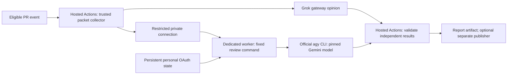

# Independent PR review integration

Date: 2026-09-14. Base: public `cortex-research` main at `d1f5a4f`.

## Objective and boundaries

Integrate the existing bounded packet reviewer as repository tooling. Use hosted
Ubuntu Actions and the existing Grok gateway contract. Reserve an independent
Gemini opinion for a qualified Antigravity subscription adapter. Do not introduce
review dependencies into the product, change a deployed installation, export
personal credentials, or substitute separately billed Google APIs.

## Implementation plan

- [x] Restore the named review discussion and check its corrected prototype.
- [x] Verify current target architecture, Actions settings and official agy docs.
- [x] Port the coordinator and focused tests; remove retired Gemini CLI OAuth code.
- [x] Update the policy for the extracted research-only product.
- [x] Add a packet-only Actions dry run and configuration diagnostics; default
      model execution and comment publication to off.
- [x] Add review-tool tests to the existing provider-free fast-checks workflow.
- [x] Validate tests, workflow syntax and a bounded GitHub packet without model calls.
- [x] Commit the integration and record exact remaining activation requirements.

## Original integration decisions

- PR head is API data only; checkout and execute trusted default-branch tooling.
- Only same-repository, non-draft PRs against the default branch are eligible.
- The two reviewer slots remain independent; unavailable Gemini yields a partial
  report, never a second Grok opinion or an apparently clean dual review.
- No credentials are currently configured in this repository or the review
  environment. A key from a different local application is not an implied review key.
- Current agy docs support cached keyring sign-in and headless output. They do
  not establish portable personal subscription login on a fresh hosted runner.
  No agy executable was found at the usual local or mini installation locations.
  Keep this adapter unavailable until authentication and tool isolation pass.
- A manual dry run collects real immutable PR input and reports readiness, without
  a provider call or a PR comment. It is useful before secrets are provisioned.
- Automatic review and publishing have separate activation switches. Neither is
  enabled by this implementation. Preserve the existing fast-checks behavior.

## Acceptance and rollback

Run dependency-free unittest and actionlint. Exercise missing configuration,
partial results, evidence anchors, stale snapshots and publisher target checks.
Use an actual same-repository PR packet when one is available. Provider success,
Google entitlement/refresh, Actions execution and comment delivery are separate
gates; document unperformed gates explicitly. Disable automatic review to stop
new inference; disable publishing independently. Revert the integration commit
to remove repository tooling; no product release or database rollback is needed.

## Validation record

- 25 dependency-free unit tests passed. Coverage includes missing configuration,
  independent/failing slots, dry-run with no provider or publisher calls, manual
  base-branch/fork refusal, evidence anchors and stale result rejection.
- actionlint 1.7.12 passed both workflow files (external shellcheck/pyflakes
  integrations disabled). No Python/Web product implementation changed.
- Real PR #1 at implementation head `5846df4` and base `d1f5a4f`: collected
  all 10 changed files, omitted none, and saved `dry_run` with both slots
  `not_run`. Collection used the real GitHub API; no provider request was made.
- Hosted Fast checks run `34814969491` passed Web, Control and review-tools.
  This proves the provider-free CI integration, not a successful live reviewer.
- The implementation was fast-forwarded to the default branch with both
  activation variables unset. Hosted Independent PR review run `34815165489`
  then succeeded on PR #1 in dry-run mode: report artifacts downloaded and
  inspected; both opinions were `not_run`; the publish job was skipped.
- Real provider calls, subscription authentication and review-comment delivery
  remain unperformed. No model activation or publication variable was enabled.
- No model credential has been read or transferred. No provider call or PR
  report publication has occurred. Gemini remains explicitly unavailable.

## Original subscription activation requirements

1. Select the Grok review gateway, callable model and existing authorized key.
   Provision only the review-specific repository variables/secret named in the
   tool README; no unrelated application key is used implicitly.
2. Qualify a supported agy personal-subscription login/refresh path and a tool-free
   adapter. Do not substitute paid Gemini API mode or count another Grok call as
   the Gemini opinion.
3. The workflow is installed and its hosted dry run passed. After provider
   qualification, enable artifact-only model runs. Confirm model identity and
   finding quality before separately authorizing comment publication.

Product 0.1.20, Control schema 19 and the qualified Hermes gen9 runtime do not
change as a result of this repository-tooling integration.

## Authentication research follow-up: September 14, 2026

The operator requested persistent OAuth where practical and proposed a gateway
API key as an alternative. This expands the options for a deliberately selected
Gemini gateway lane; it does not enable automatic billing-route fallback.

- Official Grok Build docs establish browser and device-code login with renewal.
  The current HTTP-only Grok adapter does not implement that CLI route.
- agy docs establish cached keyring and SSH authorization, plus an explicit
  Gemini-compatible API-key mode. Unattended subscription renewal and tool
  isolation on the selected host remain qualification gates.
- Upstream Sub2API supports provider/composite routing and multiple protocols.
  Deployment support, review-key scope and actual callable models must be tested
  separately. A working OpenAI key is not Grok/Gemini access evidence.
- The tool README now contains concrete login and gateway setup steps. No CLI
  was installed, provider inference attempted, Actions credential provisioned, or
  workflow activation changed by this research follow-up. An explicitly
  authorized gateway catalog check did not list Grok or Gemini models.

## Hosted gateway configuration: September 14, 2026

The operator selected GitHub-hosted execution and supplied separate gateway keys.
The current follow-up selects Grok chat completions and Gemini native
generateContent; the disabled subscription adapter remains an optional future
route, not an automatic fallback.

- Provisioned `GROK_API_KEY` and `GEMINI_API_KEY` as encrypted secrets in the
  `pr-review` environment. Its selected-branch policy permits only `main`.
  There are no repository-level copies of these secrets.
- Added the protected environment to the review job and supplied credentials
  only to its inference step. Dry runs and the publisher receive no model keys.
- Manual review on the default branch is independent of automatic PR triggers.
  Forks, drafts and non-default targets remain refused; PR head content remains
  API data and never executable code.
- Gateway catalogs accepted both keys, but smoke inference returned HTTP 503.
  Gemini's native endpoint reported no available upstream Gemini accounts.
  Catalog entries are not evidence of working inference. Automatic invocation
  and publication remain explicitly false until upstream qualification passes.
- After the operator repaired gateway groups, Grok completed an actual packet
  review as `grok-4.6`. Gemini's updated catalog listed only 2.0/2.5 models and
  rejected the previously listed 3.1 model. Testing `gemini-2.5-pro` returned
  HTTP 502, followed by HTTP 503 with no available Gemini accounts. The Gemini
  upstream and hosted dual-review acceptance remain incomplete.
- 31 focused tests and actionlint 1.7.12 passed. Tests cover independent keys and
  protocols, native Gemini output, incomplete/blocked/tool output, invalid model
  paths, redacted failures and the existing snapshot/publication gates.
- Workflow changes are prepared for review; hosted dual-model inference has not
  passed. Key storage is complete independently of provider availability.

## Existing PR compatibility

The first live PR retained its original base object after the default branch
advanced. Both workflow jobs therefore checkout `github.sha`, the immutable
trusted workflow revision, instead of the PR's older base object (which may
predate the tool). Manual dispatch is restricted to the default branch;
`pull_request_target` runs in default-branch context. Packet base/head identity
and stale-result checks remain separate. See the official GitHub
[trigger reference](https://docs.github.com/en/actions/reference/workflows-and-actions/events-that-trigger-workflows#pull_request_target).

## agy CLI and OAuth Actions deployment study

Implementation update: the selected deployment now uses GitHub-hosted Ubuntu
with restored native consumer OAuth, rather than a persistent worker. Local
agy 1.2.2 qualification proved fresh-HOME renewal with an unchanged refresh
token and validated JSON output; two independent hosted jobs remain the next
gate. The operational contract is in [the tool README](../../tools/pr_review/README.md).
The research below records the options considered before this live evidence.

Researched September 14, 2026. This is a proposed deployment design, not an
installed or accepted OAuth workflow. The requirement is to retain the official
agy executable and the operator's personal Google subscription login while
automating PR reviews through GitHub Actions. Existing gateway credentials and
PR #2 remain available; no route is silently substituted.

### Recommendation

Keep packet collection, Grok gateway review, result validation and optional
publication on GitHub-hosted runners. Execute the Gemini opinion through a fixed
agy worker on a dedicated persistent host. The worker can live on a VM on the
mini, another trusted machine, or a small cloud VM. The mini is not a required
part of the protocol. A worker host must be reachable while processing reviews;
no GPU is required because model inference remains remote.

This recommendation is an engineering judgment: retaining OAuth state on its
original host avoids adding cross-machine credential restoration and refresh
write-back to the first implementation. It does not guarantee that an account
will never need reauthorization. If eliminating the worker host is the highest
priority, first run the bounded hosted-runner experiment below.

| Deployment | Official agy retained | Personal subscription OAuth | Main tradeoff |
| --- | --- | --- | --- |
| Hosted Actions plus fixed remote worker | Yes | Yes, after host qualification | One persistent host; no OAuth export to Actions |
| Private automation repository plus self-hosted runner | Yes | Yes, after host qualification | No inbound service needed; extra dispatch and result plumbing |
| Hosted runner/container plus restored OAuth file | Yes | Potentially; not yet qualified | Requires cross-job restore and refresh-lifecycle evidence |
| Hosted runner plus Google Cloud ADC/WIF | Yes | Different account/entitlement route | Cloud setup, billing and model compatibility qualification |
| Direct gateway HTTP review | No | Determined by gateway upstream | Existing API implementation; does not meet this harness requirement |

### What current sources establish

The official [authentication guide](https://antigravity.google/docs/cli/install/)
supports local keyring reuse and interactive SSH authorization. The
[headless guide](https://antigravity.google/docs/cli/headless/) exposes JSON,
streamed stdin, explicit model selection and structured output. This is enough
to design a CLI adapter; it is not an end-to-end hosted personal-OAuth recipe.

Current documentation navigation labels the CLI 1.2.0, but the official
installer's Linux amd64 and Darwin arm64 release manifests both returned 1.2.2.
Pin the actual binary version and SHA-512 digest. The
[changelog](https://github.com/google-antigravity/antigravity-cli/blob/ba985e6b5de2ac8aa09860a154a102831eb7722b/CHANGELOG.md)
records Linux headless/keyring improvements in 1.1.3, a longer keyring deadline
in 1.1.12 and proactive OAuth renewal in 1.1.23. It also records headless timeout
returning partial output with exit zero in 1.1.28. Therefore require validated
terminal status, complete structured findings, absence of timeout/truncation,
and an outer process deadline; exit zero alone is insufficient. Version 1.2.1
adds custom-agent exclusion of default components, but hooks remain relevant.

File persistence is a real implementation path, not just a hypothetical one:
[issue #854](https://github.com/google-antigravity/antigravity-cli/issues/854)
reports that an ordinary CLI process succeeded with `GEMINI_FORCE_FILE_STORAGE`
on 1.1.18, while its Remote Control daemon failed. That flag is a reported
implementation detail requiring verification on the selected release, not an
established public configuration contract. Older
[issue #479](https://github.com/google-antigravity/antigravity-cli/issues/479)
reports failed token restoration on 1.0.x. The issue remains open, but does not
prove 1.2.2 has the same defect. Reports speculating about device binding are
not sufficient to claim that the provider enforces device-bound credentials.

### Existing implementations assessed

- [Brutalist OAuth provisioning](https://github.com/ejmockler/brutalist-mcp/blob/cce615049ef2802f0f92814328d2509390a4eeca/packages/github-action/src/oauth-provisioning.ts)
  writes an agy OAuth JSON secret to its native token-file path with mode 0600.
  It compares refresh-token fingerprints after use, but only warns on rotation;
  it does not durably save a replacement token for future jobs. Its adapter has
  older PTY/model workarounds, and the Action requires a Claude orchestrator.
  Borrow the credential-lifecycle checks as design evidence rather than adding
  that entire orchestration stack to this two-opinion tool.
- [GoogleCloudPlatform EvalBench](https://github.com/GoogleCloudPlatform/evalbench/blob/main/docs/agy_cli_agent_testing.md)
  is a useful example of driving the real agy binary with structured events.
  Its [August 10 change](https://github.com/GoogleCloudPlatform/evalbench/commit/8d9a8505a3cf74924ede5655b9903189a8f97ddf)
  removed host OAuth mirroring in favor of ADC. Search snippets still expose
  older instructions. The current example is evidence for automated agy, not
  evidence that personal AI Pro tokens work in hosted Actions.
- [agy-bridge](https://github.com/Cute-chen/agy-bridge) routes the CLI to a
  third-party API and bypasses its Google login. It does not retain the requested
  OAuth route. An OAuth-to-HTTP proxy that bypasses the CLI similarly fails the
  requirement to preserve its harness.
- The official [Python SDK](https://antigravity.google/docs/sdk/overview/)
  documents Gemini API-key and Google Cloud setup. It is not documented as a
  drop-in way to reuse a personal agy CLI subscription session.

### Minimal persistent-worker design

Use one dedicated account and one credential store for the worker. Complete
interactive personal Google login there once, and verify entitlement from that
CLI. Run future reviews as the same account, under the same service environment.
A persistent Linux VM is a portable candidate; a dedicated macOS worker avoids
introducing a Linux image but requires testing Keychain access after reboot and
from the actual background service. A mounted credential volume preserves bytes,
not proof that a new container can authenticate.

The worker accepts only a bounded review packet and trusted model/policy
selection. Expose a fixed command, not arbitrary shell execution, caller-supplied
executables, environment variables or checkout paths. One way to connect is the
[Tailscale GitHub Action](https://tailscale.com/docs/integrations/github/github-action):
it supports federated workflow identity and ephemeral nodes. Restrict identity
claims and network access to the intended repository, workflow, branch/environment
and worker port. Pair transport access with service authentication or a dedicated
forced SSH command. Network membership alone does not authorize every review.
An ordinary SSH implementation should pin the host key, disable forwarding and
interactive shells, and invoke a fixed worker entry point with packet data on
stdin. It needs no public inference API or general-purpose agent dashboard.

Acquire an account-level lock before invoking agy. PR-level Actions concurrency
does not prevent two different PRs from modifying the same OAuth store. Start a
fresh conversation for every PR, keep each workspace disposable, and preserve
only authentication/configuration outside it. Do not reuse a previous PR's
conversation through `--continue`. Enforce an outer timeout and reap the full
process group; the latest CLI can leave daemon tasks alive after print mode.

Start with the existing packet-only review scope. Preserve the native CLI's
reasoning and structured response path, while excluding ambient hooks, skills,
MCP servers and shell/write/network tools. Qualify custom-agent settings and
[deny policies](https://antigravity.google/docs/cli/permissions/) on the pinned
binary. If later enabling code exploration, supply a read-only snapshot and
explicit read tools; accepting arbitrary repository setup scripts is a separate
scope change. Keep OAuth files inaccessible through agent tools. The CLI itself
must read its credential store, so policy settings alone are not an OS sandbox.

### Public repository and Actions boundaries

Do not register the operator's general-purpose mini as an unrestricted runner
for the public repository. GitHub's
[runner access guidance](https://docs.github.com/en/actions/how-tos/manage-runners/self-hosted-runners/manage-access)
recommends private repositories for self-hosted runners. Labels route jobs;
they are not a security boundary. A main-only Environment gates jobs that use
that Environment; it cannot protect persistent host credentials from a different
workflow that obtains execution on the same runner without referencing it.

The recommended fixed worker avoids exposing an arbitrary Actions runner on the
OAuth host. If native runner scheduling is preferred, register it only to a
dedicated private automation repository. A constrained GitHub App token can
dispatch a validated request there; the public repository's GITHUB_TOKEN alone
does not grant private cross-repository access. Keep the private worker job's
GitHub permissions minimal and return results to a hosted validation/publishing
job. This adds dispatch and artifact retrieval work, so it is a secondary option.

Retain the current trusted default-branch checkout, same-repository/non-draft
eligibility checks, immutable base/head binding and stale-result refusal. Pin
external Actions to reviewed commit SHAs. Separate the optional publisher and
its GitHub write token from model execution. Upload only normalized reports,
never an agy home, raw debug logs, OAuth JSON or conversation databases. These
are concrete design requirements for this public repository, consistent with
GitHub's [secure-use guidance](https://docs.github.com/en/actions/reference/security/secure-use).

### Experiment for entirely GitHub-hosted execution

A personal-OAuth deployment without a persistent worker is worth testing, but
must be described as experimental until all of these gates pass:

1. Obtain a personal subscription session using the exact pinned CLI build and
   record the credential backend. Bootstrap login is interactive; do not assume
   a Google service account represents the user's AI Pro subscription.
2. Restore the native OAuth state into a private credential directory of a clean
   matching hosted container/job. Verify file-mode selection rather than assuming
   an Ubuntu hosted VM is detected as a container. Use mode 0600 and no shell tracing.
3. Complete a harmless prompt, then a second fresh process with no sign-in. Start
   a second independent Actions job from the same original secret and repeat.
4. After the actual access token expires, repeat from a fresh job. Observe whether
   agy refreshes successfully and whether the refresh token itself changes, without
   printing it. A successful run before expiration proves only initial access.
5. If refresh tokens rotate, choose a durable, serialized secret-store update
   mechanism. Do not assume GitHub Secrets automatically receive CLI file writes.
   A persistent external token broker adds much of the infrastructure this option
   was intended to remove. Concurrent refresh and cancellation need explicit tests.
6. Inspect failures, logs and artifacts for both original and newly minted tokens.
   A JSON secret is not enough for partial-string redaction: register individual
   sensitive fields and avoid forwarding raw CLI output. Credentials must never
   enter an Actions cache or artifact. Fail unavailable on reauthorization; do not
   downgrade to another model or silently switch to API billing.

Google's [OAuth lifecycle documentation](https://developers.google.com/identity/protocols/oauth2#expiration)
explains why refresh tokens may outlive access tokens but can still be revoked,
expire after inactivity, or be invalidated by issuance limits. It does not
establish the lifetime, portability or rotation behavior of this exact agy
session. No permanent-login guarantee is appropriate.

### Cloud-native alternative with a different entitlement

The official [enterprise guide](https://antigravity.google/docs/enterprise)
documents `AGY_ADC_AUTH=true`, Google Cloud project setup and Cloud/enterprise
licensing. The [Google authentication Action](https://github.com/google-github-actions/auth)
supports Workload Identity Federation, which can supply short-lived Cloud
credentials without copying a personal refresh token. This is a promising
entirely hosted design when Cloud billing is acceptable. agy's acceptance of the
resulting credential file, quota project, selected model and long-running token
lifetime must still be validated together. GitHub-to-Google federation does not
turn a Google One AI Pro/Ultra subscription into a workload identity entitlement.

### Repository implementation and acceptance

Reuse `prepare`, `prompt_for`, `parse_findings`, independent-slot aggregation and
`publish` in `tools/pr_review/review.py`. Add an explicitly selected agy backend
and a small fixed worker/transport adapter. Keep Grok on its qualified gateway.
Do not add an HTTP compatibility proxy, extra coordinating LLM, or OAuth client
implementation when the native CLI already owns login and renewal.

Accept the OAuth lane only after: actual subscription/model verification;
new-process and service/reboot login reuse; an expired-access-token renewal;
concurrent-PR locking; rejected file/command/MCP escape attempts; valid JSON and
evidence anchors; timeout/denial handling; and an artifact-only Actions run on a
real eligible PR. Test publication separately if it is later authorized.

Research outcome: persistent official CLI execution plus Actions orchestration
is the recommended first deployment; clean hosted OAuth restoration is a bounded
alternative experiment. No CLI was installed, OAuth exported, runner registered,
secret changed or automation enabled during this study.
